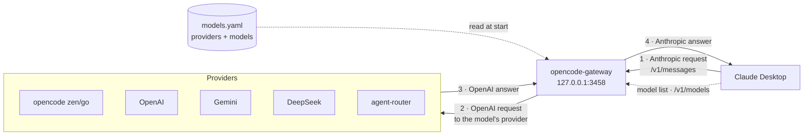
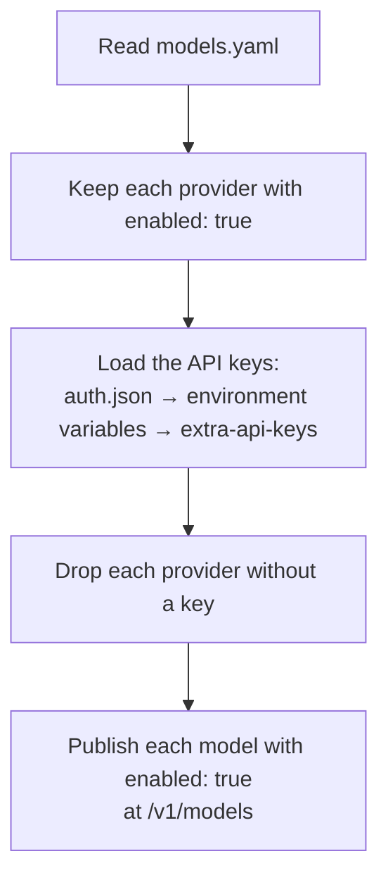

# claude-code-gateway

opencode-gateway connects Claude Desktop to other model providers. Claude
Desktop speaks the Anthropic API. The providers speak the OpenAI API. The
gateway changes one API into the other. The gateway is one program. It has no
runtime dependencies.

You configure the providers and the models in one file: `models.yaml`. To add
a model, you add lines to this file. You do not change the code.

<p align="center">

</p>

## Contents

- [How it works](#how-it-works)
- [Requirements](#requirements)
- [Build](#build)
- [Run](#run)
  - [Windows (tray program)](#windows-tray-program)
  - [Linux or WSL (headless program)](#linux-or-wsl-headless-program)
- [Configuration: models.yaml](#configuration-modelsyaml)
  - [Add a provider](#add-a-provider)
  - [Add a model](#add-a-model)
- [Keys and tokens](#keys-and-tokens)
- **[Enable Developer Mode in Claude Desktop](#enable-developer-mode-in-claude-desktop)** — connect the app
- **[Connect Claude Desktop to the gateway](#connect-claude-desktop-to-the-gateway)** — connect the app
- [Models](#models)
- [Effort levels](#effort-levels)
- [Troubleshooting](#troubleshooting)
  - [Request log](#request-log)

## How it works

Claude Desktop sends each request in the Anthropic format. The gateway finds
the provider that owns the model. The gateway changes the request into the
OpenAI format. The gateway sends the request to that provider. The provider
returns an answer. The gateway changes the answer back into the Anthropic
format. The gateway sends the answer to Claude Desktop.



At start, the gateway reads `models.yaml`. The gateway keeps each provider
that is enabled and has an API key. The gateway drops the other providers.



The gateway does three jobs:

1. It gives the model list at `/v1/models`. Claude Desktop reads this list.
2. It changes the text, images, tool calls, and reasoning between the two formats.
3. It sends the answer back in the Anthropic format, streamed or complete.

## Requirements

- Claude Desktop.
- An API key for at least one provider in `models.yaml`.
- Go 1.26 or later. You need Go only to build the program.

## Build

Use one build script.

On Linux or WSL:

```bash
./build.sh
```

On Windows:

```powershell
.\build.ps1
```

Each script makes two files:

- `opencode-gateway` — the program for Linux.
- `opencode-gateway.exe` — the tray program for Windows.

To build and copy the Windows program to the install folder, add `deploy`:

```bash
./build.sh deploy
```

## Run

The gateway reads `models.yaml` from the folder where you start it. If the
file is not there, the program stops with an error. Keep `models.yaml` next
to the program.

### Windows (tray program)

1. Double-click `opencode-gateway.exe`.
2. An icon shows in the system tray.
3. Right-click the icon to see the menu. The menu shows:
   - **Pause** — stop the gateway. Click again to start the gateway.
   - **Quit** — stop the gateway and close the program.

To start the program with Windows, put a shortcut in the Startup folder. Press
`Win+R`. Type `shell:startup`. Press Enter. Put the shortcut in the folder.

### Linux or WSL (headless program)

```bash
./opencode-gateway
```

The default port is `3458`. To change the port, set `GATEWAY_PORT`:

```bash
GATEWAY_PORT=3500 ./opencode-gateway
```

## Configuration: models.yaml

One file configures the gateway: `models.yaml`. The file has two parts:

- `providers` — the upstream services and their models.
- `extra-api-keys` — keys for services that do not use an environment
  variable. This part is optional.

### Add a provider

Add a block under `providers`. Example:

```yaml
providers:
  openai:
    enabled: true
    api_type: openai
    env_var: OPENAI_API_KEY
    base_url: https://api.openai.com/v1/chat/completions
    claude_system_prompt: false
    models:
      # models go here
```

The provider fields:

| Field | Meaning |
|---|---|
| `enabled` | `true` makes the provider active. `false` hides all its models. |
| `api_type` | The name of the key this provider uses. See [Keys and tokens](#keys-and-tokens). |
| `env_var` | The environment variable that holds the API key. |
| `base_url` | The full URL of the chat completions endpoint. |
| `claude_system_prompt` | `true` sends the Claude Desktop system prompt to the provider. |
| `user_agent` | Optional. The User-Agent header for requests. Some services block the default Go client. |
| `models` | The models this provider serves. |

A provider without a key does not start. The gateway drops it and writes no
error. To supply a key without an environment variable, put the key in
`extra-api-keys`:

```yaml
extra-api-keys:
  agent-router: <your key>
```

**Warning:** `extra-api-keys` puts a secret in a file. Do not commit this file
with a real key.

### Add a model

Add a block under the provider's `models`. Example:

```yaml
      gemini-2.0-flash:
        enabled: true
        label: Gemini 2.0 Flash
        alias: claude-gemini-2-flash
        real: gemini-2.0-flash
        max_in: 1048576
        max_out: 65536
        vision: true
```

The model fields:

| Field | Meaning |
|---|---|
| `enabled` | `true` shows the model in Claude Desktop. |
| `label` | The name Claude Desktop shows. |
| `alias` | The model id the gateway gives to Claude Desktop. It must start with `claude-`. It must not equal a real Anthropic model name. |
| `real` | The model name the provider expects. |
| `max_in` | The maximum input tokens. |
| `max_out` | The maximum output tokens. |
| `vision` | `true` lets the model accept images. |

Restart the gateway after each change to `models.yaml`. Then restart Claude
Desktop to read the new model list.

## Keys and tokens

There are two different tokens.

**The provider API keys.** These are the real keys. The gateway uses these
keys to send requests to the providers. The gateway looks for each key in
this order:

1. The opencode key store `auth.json`. The gateway reads the first file it
   finds: the path in `OPENCODE_AUTH_FILE`, then
   `$XDG_DATA_HOME/opencode/auth.json`, then
   `~/.local/share/opencode/auth.json`, then the platform folder
   (`%APPDATA%\opencode` on Windows, `~/Library/Application Support/opencode`
   on macOS).
2. The environment variable in the provider's `env_var` field. For the
   opencode key, the file in `OPENCODE_KEY_FILE` also works.
3. The `extra-api-keys` part of `models.yaml`. A key here replaces the keys
   from the other sources.

opencode stores its own key in `auth.json`. The gateway reads the same key.
You do not copy the opencode key.

**The Gateway API key.** This is the token in the Claude Desktop connection
window. Claude Desktop sends this token to the gateway with each request. The
gateway does not check this token. Type any value, for example `x`. This
token gives no access to the providers.

The gateway keeps the tokens apart. Claude Desktop never sees a provider key.
The gateway adds the provider key only when it sends the request to the
provider.

## Enable Developer Mode in Claude Desktop

Claude Desktop needs Developer Mode. Developer Mode gives the option to use a
gateway.

**Note:** Do not sign in with an Anthropic account first. Enable Developer Mode
on the sign-in screen.

1. Start Claude Desktop. Do not sign in.
2. Open the application menu.
   - On Windows, click the **☰** menu at the top-left of the sign-in screen.
   - On macOS, use the menu bar at the top of the screen.
3. Click **Help**.
4. Click **Troubleshooting**.
5. Click **Enable Developer Mode**.

## Connect Claude Desktop to the gateway

1. Start the gateway. See [Run](#run).
2. Open the application menu again.
3. Click **Developer**.
4. Click **Configure Third-Party Inference…**. A window opens.
5. Set the fields:

   | Field | Value |
   |---|---|
   | Connection | Gateway |
   | Gateway base URL | `http://127.0.0.1:3458` |
   | Gateway API key | any value, for example `x` |
   | Gateway auth scheme | Bearer |
   | Credential kind | Static API key |
   | Model discovery | On |

6. Click **Apply locally**. The app closes and starts again.
7. On the sign-in screen, choose the option to start in third-party mode.

If the models do not show, close Claude Desktop fully. Start Claude Desktop
again. Claude Desktop reads the model list one time and keeps it. A restart
reads the list again.

To check the connection, click **Help → Troubleshooting → Copy Managed
Configuration Report**. The report shows if the key is valid.

## Models

The model list comes from `models.yaml`. The gateway shows each model that
has `enabled: true` under a provider that is active. The default file ships
models from opencode zen (DeepSeek, Kimi, Qwen, GLM, and others), free zen
models, and example blocks for OpenAI, Gemini, DeepSeek, and agent-router.

The gateway supports text, images, tool calls, reasoning, and streaming. A
model with `vision: true` accepts images. All models accept tool calls.

A reasoning model thinks before it answers. The provider sends the thought in
a `reasoning_content` field. The gateway shows the thought as an Anthropic
*thinking* block before the answer. The reply does not look empty while the
model thinks.

## Effort levels

The model list marks the effort levels for every model. Claude Desktop shows
its effort picker. The gateway sends the chosen level to the provider as
`reasoning_effort`.

The providers accept `low`, `medium`, and `high`. If a client sends the
Anthropic-only levels `xhigh` or `max`, the gateway maps them to `high`
(you can still change it with `/model`).

## Troubleshooting

| Problem | Action |
|---|---|
| Claude Desktop shows no models | Restart Claude Desktop to read the model list again. |
| One model is missing | Check `enabled: true` on the model and on its provider in `models.yaml`. |
| All models of one provider are missing | The provider has no key. Set the variable in `env_var`, or add the key to `extra-api-keys`. |
| The gateway stops at start | `models.yaml` is missing. Put the file next to the program. |
| The gateway returns 401 | Check that the provider key is present. See [Keys and tokens](#keys-and-tokens). |
| The exe does not update | Quit the tray program first. The running program locks the file. |

### Request log

To see each request that Claude Desktop sends, set `GATEWAY_LOG=1` and start
the gateway. The gateway writes `gateway.log` next to the program. Each line
shows the model alias, the real model, the provider URL, stream and effort
settings, the upstream status, and the latency. Set `GATEWAY_LOG` to a full
path to choose the log file location.

On Windows:

```powershell
$env:GATEWAY_LOG = "1"
& "C:\path\to\opencode-gateway.exe"
```
